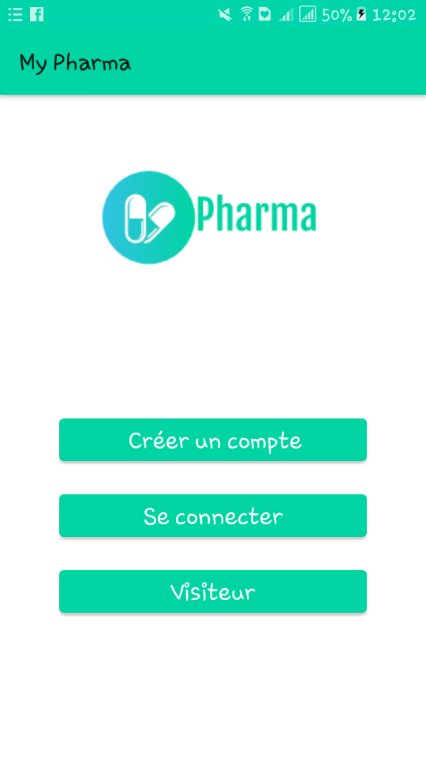
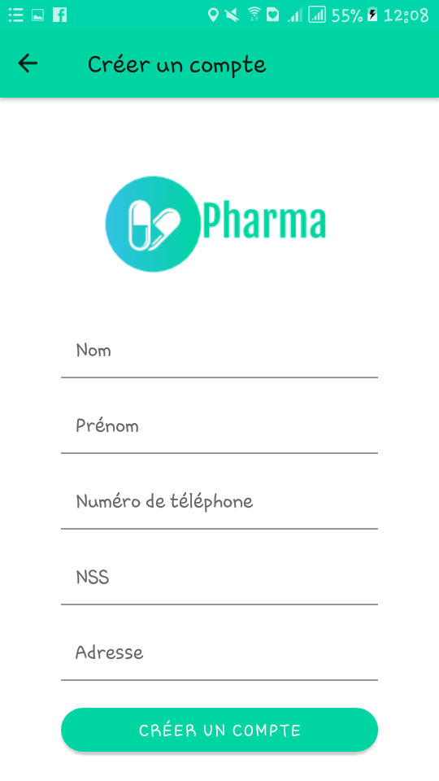
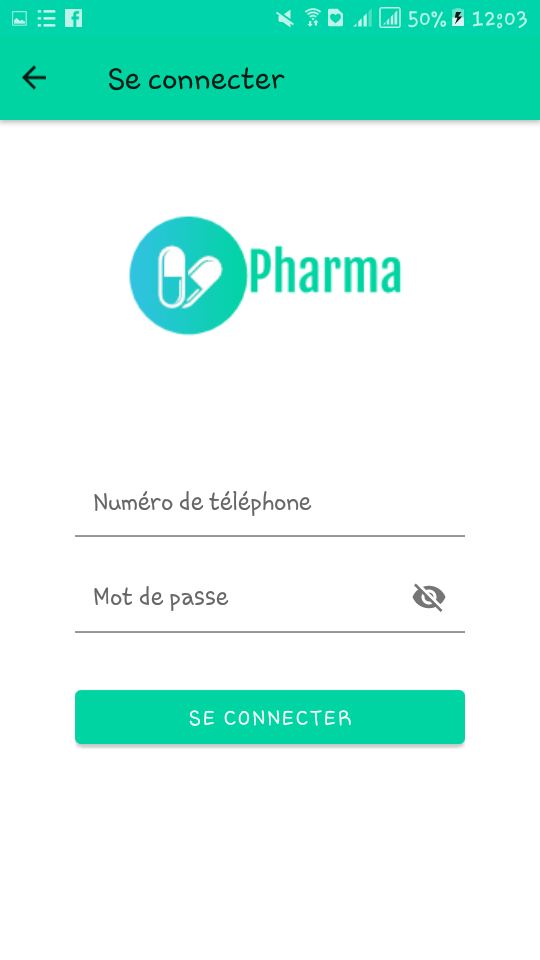
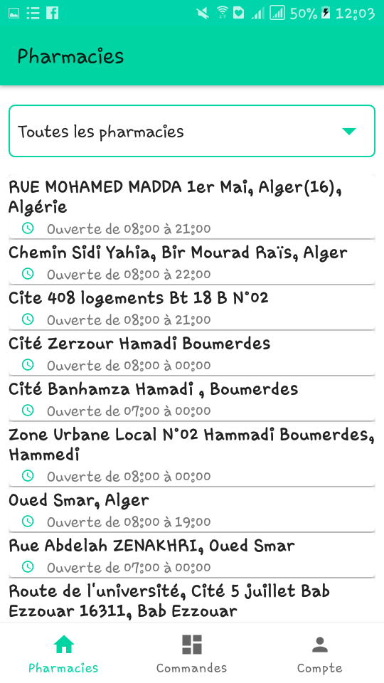
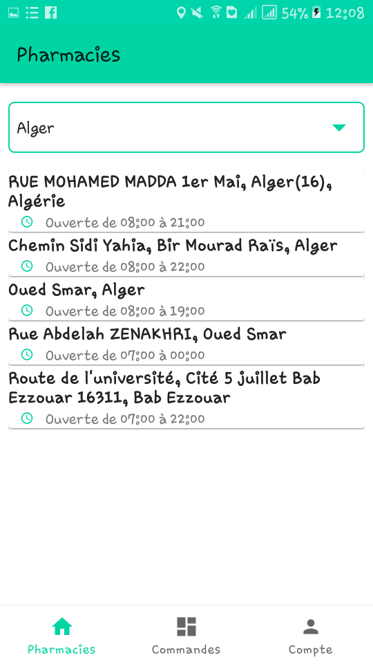
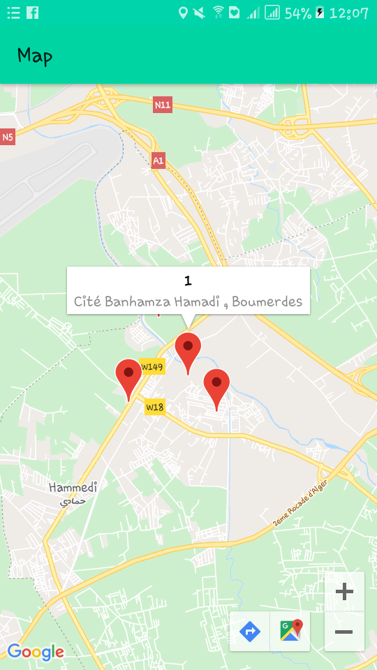

# My-Pharma-App
Application mobile pour les clients des pharmacies pharmacies.
Elle offre les fonctionnalités:

1- Création d'un compte et l'athentification

2- Affichage des pharmacies par villes

3- Affichage des pharmacies les plus proches

4- Gestion des commande (faire une commande, suivre son état et payer la commande)

